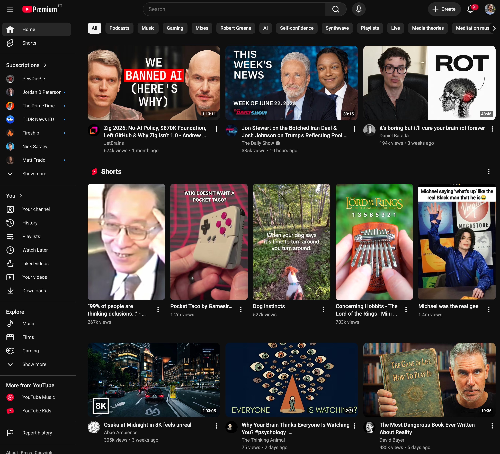
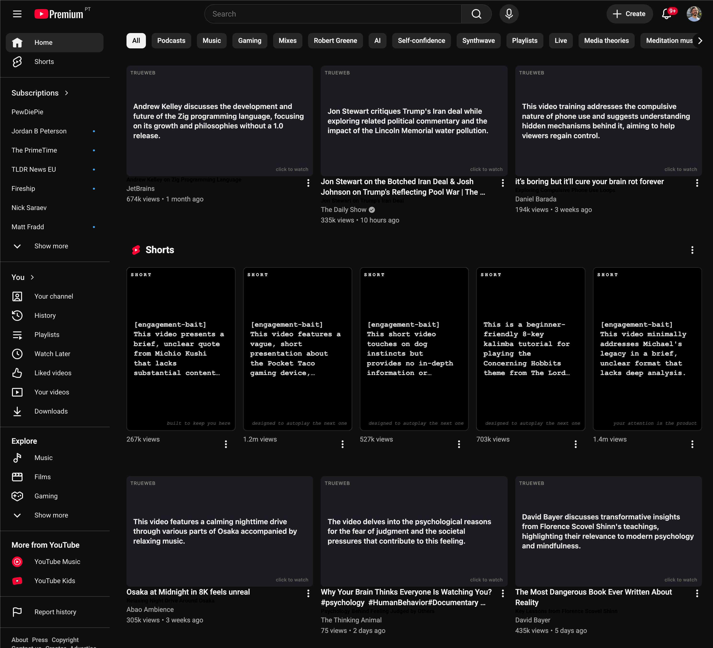

# TrueWeb

This is a chrome extension experiment to raise awareness of what your feed is feeding you.

## Before / after

The same YouTube home page, with the glasses off and on.

| Without TrueWeb | With TrueWeb |
| --- | --- |
|  |  |

## Install (unpacked)

1. Open `chrome://extensions` and enable **Developer mode**.
2. Click **Load unpacked** and select this folder.
3. Click the TrueWeb toolbar icon, choose a provider, paste your API key, and Save.

## Configure

TrueWeb calls an LLM directly from your browser. In the popup:

- **Provider:** OpenAI-compatible (OpenAI, OpenRouter, Groq, …) or Anthropic.
- **API base URL:** e.g. `https://api.openai.com/v1`, or `https://openrouter.ai/api/v1`.
- **API key:** your provider key (stored locally in `chrome.storage.local`).
- **Model:** e.g. `gpt-4o-mini`, `openai/gpt-4o-mini`, `claude-haiku-4-5`.

The model must support structured/JSON-schema output (most current chat models do).

## Use

- Toggle: **Alt+Shift+Y** (or the floating widget).
- Decode visible items: **Alt+Shift+D**.
- On YouTube it turns on automatically.

## Privacy

See [PRIVACY.md](PRIVACY.md). Short version: your key stays in your browser; only the titles/authors (and optional descriptions) of visible items are sent to the LLM provider *you* configure, only when decoding. No analytics, no servers operated by this project.

## Extend it

It's an experiment. Fork it and take it wherever you like.

## License

MIT — see [LICENSE](LICENSE).
